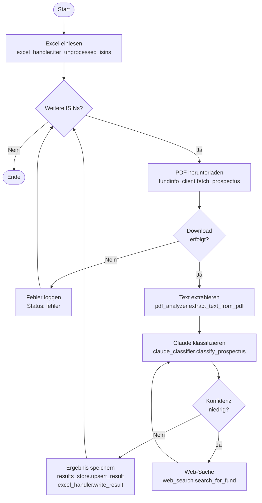
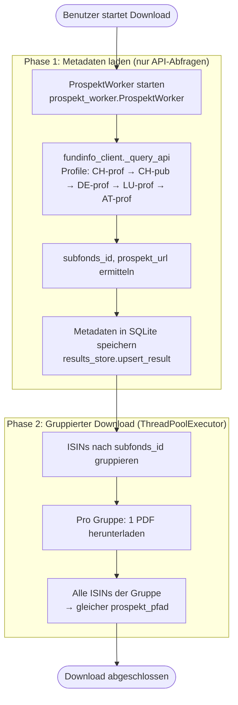
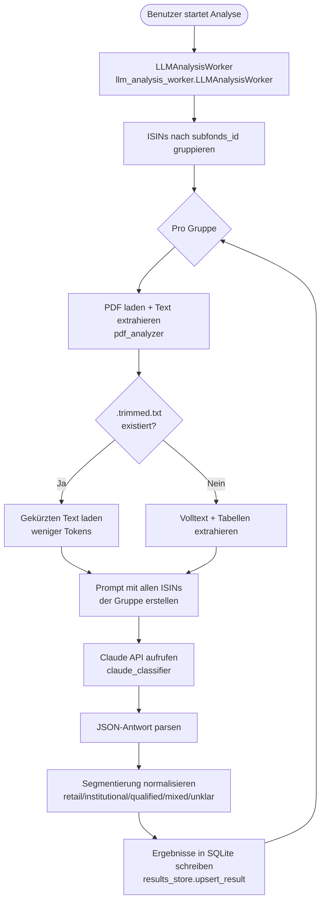
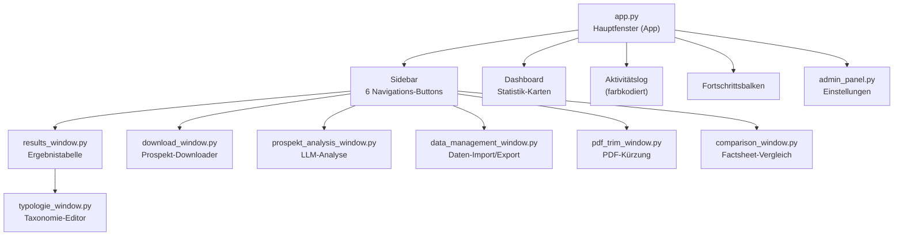

# FundsprospectPilot – Software-Architektur

## Übersicht

FundsprospectPilot ist eine Desktop-Applikation (Python/Tkinter) zur automatisierten Klassifizierung von Fondsprospekten (institutionell vs. Retail) mittels Claude AI. Sie kombiniert eine interaktive GUI mit einem CLI-Batch-Modus und einem eigenständigen Downloader-Modul.

---

## 1. Gesamtarchitektur

```
┌─────────────────────────────────────────────────────────────────────┐
│                        EINSTIEGSPUNKTE                              │
│                                                                     │
│   src/app.py (GUI)          src/main.py (CLI)    downloader/        │
│   Tkinter-Hauptfenster      Batch-Verarbeitung   Standalone-DL      │
└────────────┬────────────────────────┬────────────────────┬──────────┘
             │                        │                    │
             ▼                        ▼                    ▼
┌────────────────────────────────────────────────────────────────────┐
│                        KERN-LOGIK                                  │
│                                                                    │
│  analysis_workflow.py   claude_classifier.py   pdf_analyzer.py    │
│  fundinfo_client.py     excel_handler.py        web_search.py     │
│  results_store.py       utils.py                                  │
└────────────────────────────┬───────────────────────────────────────┘
                             │
             ┌───────────────┼───────────────┐
             ▼               ▼               ▼
    ┌─────────────┐  ┌──────────────┐  ┌──────────────┐
    │  Anthropic  │  │ fundinfo.com │  │  SQLite DB   │
    │  Claude API │  │  JSON API    │  │  results.db  │
    └─────────────┘  └──────────────┘  └──────────────┘
```

---

## 2. Modulstruktur

```
FundsprospectPilot/
├── src/                          # Hauptanwendung
│   ├── app.py                    # GUI-Hub (Sidebar-Navigation, Dashboard)
│   ├── main.py                   # CLI Batch-Einstiegspunkt
│   ├── analysis_workflow.py      # Batch-Pipeline-Orchestrierung
│   │
│   ├── ── KERN-DIENSTE ──────────────────────────────────
│   ├── claude_classifier.py      # Claude-API-Klassifizierung
│   ├── pdf_analyzer.py           # PDF-Text-Extraktion (pdfplumber + OCR)
│   ├── fundinfo_client.py        # fundinfo.com API-Client
│   ├── excel_handler.py          # Excel-I/O (openpyxl)
│   ├── web_search.py             # DuckDuckGo Fallback-Suche
│   ├── results_store.py          # SQLite-Datenbankschicht
│   ├── utils.py                  # Logging, Hilfsfunktionen
│   │
│   ├── ── WORKER-THREADS ────────────────────────────────
│   ├── prospekt_worker.py        # 2-Phasen Download-Worker
│   ├── llm_analysis_worker.py    # LLM-Klassifizierungs-Worker
│   │
│   └── ── GUI-FENSTER ───────────────────────────────────
│       ├── results_window.py     # Ergebnistabelle (Treeview)
│       ├── download_window.py    # Prospekt-Downloader UI
│       ├── prospekt_analysis_window.py  # Analyse-Orchestrator
│       ├── data_management_window.py    # ISIN-Import / Export
│       ├── admin_panel.py        # Einstellungen (API-Key, Modell)
│       ├── pdf_trim_window.py    # PDF-Kürzung + Tabellenextraktion
│       ├── comparison_window.py  # Factsheet-Vergleichsanalyse
│       ├── typologie_window.py   # Taxonomie-Editor
│       └── typologie_store.py   # Fondstyp/Anlegertyp/Kundentyp-DB
│
└── downloader/                   # Eigenständiger Downloader
    ├── main.py                   # Einstiegspunkt
    └── src/
        ├── download_window.py    # Wiederverwendete Download-UI
        ├── fundinfo_client.py    # Wiederverwendeter API-Client
        ├── prospekt_worker.py    # Worker (externer DB-Pfad)
        ├── results_store_ext.py  # DB-Adapter (konfigurierbar)
        └── utils.py             # Gemeinsame Hilfsfunktionen
```

---

## 3. Hauptdatenfluss (Batch-Verarbeitung)



---

## 4. Prospekt-Download (Gruppen-Workflow)



---

## 5. LLM-Analyse-Workflow



---

## 6. Kern-Module im Detail

### 6.1 `claude_classifier.py` – Klassifizierung

```
classify_prospectus(text, isin, web_context?)
│
├── System-Prompt (mit Prompt-Caching)
│   └── "Klassifiziere den Fondsprospekt nach 6 Feldern..."
│
├── Input: PDF-Text (max. 80.000 Zeichen) + optionaler Web-Kontext
│
├── Modell-Auswahl:
│   ├── Batch-Modus  → claude-haiku-4-5  (schnell, günstig)
│   ├── Einzeln      → claude-sonnet-4-6  (präzise)
│   └── Schwierig    → claude-opus-4-7    (komplex)
│
└── Output JSON:
    ├── segmentierung: "retail" | "institutional" | "unklar"
    ├── fondstyp:      "ETF" | "AIF" | "UCITS" | ...
    ├── anlegertyp:    "Professionelle Anleger" | "Privat" | ...
    ├── kundentyp:     "Pensionskassen" | "HNWI" | ...
    ├── begruendung:   1-3 Sätze Begründung
    └── konfidenz:     "hoch" | "mittel" | "niedrig"
```

### 6.2 `fundinfo_client.py` – API-Client

```
fetch_prospectus(isin, output_dir)
│
├── Phase 1: API-Abfrage (alle Profile + Sprachen)
│   ├── Profile-Reihenfolge: CH-prof → CH-pub → DE-prof → LU-prof → AT-prof
│   ├── Sprach-Präferenz:    DE > EN > FR > IT > ES
│   └── _query_api() → _best_doc_from_list()
│
├── Phase 2: PDF-Download
│   ├── HTTP GET mit Retry (max. 3 Versuche)
│   ├── Rate-Limiting: 1,5s Pause zwischen Anfragen
│   └── Validierung: PDF-Header prüfen
│
└── DownloadResult:
    ├── path      → lokaler Dateipfad
    ├── url       → Quell-URL
    ├── language  → Dokumentsprache
    └── profile   → fundinfo-Profil
```

### 6.3 `results_store.py` – Datenbankschicht

```
SQLite: data/output/results.db
Tabelle: fund_results (Primärschlüssel: isin)

Spalten (32 gesamt):
├── Identifikation:   isin, subfonds_id, subfonds_name, umbrella_id
├── Fondsdaten:       fondsname, fondswaehrung, anteilsklasse, ausschuettungsart
├── Klassifizierung:  segmentierung, fondstyp, anlegertyp, kundentyp
├── LLM-Ergebnis:     llm_segmentierung, llm_segmentierung_begruendung
├── Konfidenz:        konfidenz, begruendung, modell
├── Dokumente:        pdf_datei, prospekt_pfad, prospekt_url, quelle
├── Finanzdaten:      ter, fundinfo_ter
└── Zeitstempel:      analysiert_am, erstellt_am, ueberschrieben_am

Funktionen:
├── init_db()          → Schema erstellen + migrieren
├── upsert_result()    → INSERT OR REPLACE
├── get_stats()        → Statistiken (total, retail, institutional, unklar)
├── list_results()     → Gefilterte Ergebnisliste
└── search()           → Volltextsuche
```

### 6.4 `pdf_analyzer.py` – Text-Extraktion

```
extract_text_from_pdf(pdf_path)
│
├── Primär: pdfplumber
│   └── Seite für Seite Text extrahieren
│
└── Fallback: OCR (wenn pdfplumber leer)
    ├── pdf2image → PIL-Images
    └── pytesseract → OCR-Text

extract_relevant_text(full_text)
│
└── Keyword-basierte Filterung
    ├── Anleger-Abschnitte
    ├── Anteilsklassen
    └── Zielgruppen-Beschreibungen
    → Reduzierte Token-Anzahl für Batch-Modus
```

### 6.5 `analysis_workflow.py` – Pipeline-Orchestrierung

```
Config (dataclass):
├── excel_path    → Eingabe-Excel
├── pdf_folder    → PDF-Ausgabeordner
├── batch_size    → ISINs pro Lauf (Standard: 200)
├── api_key       → Anthropic API-Key
└── skip_done     → Bereits verarbeitete überspringen

BatchProcessor.run():
├── excel_handler.iter_unprocessed_isins()
├── for isin in isins:
│   ├── fundinfo_client.fetch_prospectus()
│   ├── pdf_analyzer.extract_text_from_pdf()
│   ├── claude_classifier.classify_prospectus()
│   ├── [web_search falls konfidenz="niedrig"]
│   └── results_store.upsert_result() + excel_handler.write_result()
└── ProgressEvent → GUI-Queue (typ, nachricht, isin, ergebnis, fortschritt)
```

---

## 7. GUI-Architektur



---

## 8. Thread-Kommunikation

```
  Hauptthread (GUI)                    Worker-Thread
  ─────────────────                    ─────────────
  app.py                               prospekt_worker.py
  │                                    llm_analysis_worker.py
  │  queue.Queue                       │
  │◄──────────────────────────────────│ worker.emit(ProspektEvent)
  │                                    │
  │ app._poll_queue()                  │
  │ (alle 200ms, non-blocking)         │
  │                                    │
  └─► GUI aktualisieren                └─► Läuft im Hintergrund
      Fortschrittsbalken
      Aktivitätslog
      Statistik-Karten
```

---

## 9. Externe Integrationen

```
┌──────────────────────────────────────────────────────────────┐
│                   EXTERNE DIENSTE                            │
│                                                              │
│  ┌─────────────────────────────────────────────────────┐    │
│  │  Anthropic Claude API                               │    │
│  │  client.messages.create()                           │    │
│  │  ├── Modelle: haiku / sonnet / opus                 │    │
│  │  ├── Prompt-Caching (Kostenoptimierung)             │    │
│  │  └── Max. 512 Tokens Ausgabe                        │    │
│  └─────────────────────────────────────────────────────┘    │
│                                                              │
│  ┌─────────────────────────────────────────────────────┐    │
│  │  fundinfo.com JSON API                              │    │
│  │  GET /en/{profile}/LandingPage/Data?query={ISIN}    │    │
│  │  ├── Profile: CH-prof, CH-pub, DE-prof, LU-prof     │    │
│  │  └── Rate-Limit: 1,5s Pause zwischen Anfragen       │    │
│  └─────────────────────────────────────────────────────┘    │
│                                                              │
│  ┌─────────────────────────────────────────────────────┐    │
│  │  DuckDuckGo Search (Fallback)                       │    │
│  │  duckduckgo-search Bibliothek (kein API-Key)        │    │
│  │  └── Nur bei konfidenz = "niedrig"                  │    │
│  └─────────────────────────────────────────────────────┘    │
└──────────────────────────────────────────────────────────────┘
```

---

## 10. Datenpersistenz

```
data/
├── input/
│   └── fonds_universe.xlsx        ← ISINs + Eingabedaten
├── output/
│   ├── results.db                 ← SQLite (32 Spalten, ~alle Fonds)
│   └── errors.log                 ← Anwendungslog
├── prospekte/
│   └── 11111_FondName.pdf         ← Heruntergeladene PDFs (5-stellig)
├── comparisons/
│   └── vergleich_*.pdf            ← Generierte Vergleichsberichte
└── samples/
    └── *.pdf                      ← Test-PDFs
```

---

## 11. Konfiguration (.env)

| Variable | Standard | Beschreibung |
|---|---|---|
| `ANTHROPIC_API_KEY` | – | Pflichtfeld, von console.anthropic.com |
| `EXCEL_PATH` | `data/input/fonds_universe.xlsx` | Eingabe-Excel |
| `PDF_FOLDER` | `data/prospectus` | PDF-Ausgabeordner |
| `BATCH_SIZE` | `200` | ISINs pro Lauf |
| `CLAUDE_BATCH_MODEL` | `claude-haiku-4-5-20251001` | Batch-Modell |
| `CLAUDE_SINGLE_MODEL` | `claude-sonnet-4-6` | Einzelanalyse-Modell |

---

## 12. Taxonomie-System (`typologie_store.py`)

```
SQLite-Tabelle: typologie
├── Fondstyp:    ETF, Anlagestiftung, Publikumsfonds, Institutioneller Fonds
├── Anlegertyp:  Professionelle Anleger, Privat, Qualifizierte Anleger
└── Kundentyp:   19 Werte
    ├── Institutionell: Pensionskassen, Versicherungen, Stiftungen,
    │                   Anlagestiftungen, Banken, Family Offices, ...
    └── Retail:         Privatanleger, HNWI, Wohlhabende Privatkunden, ...

Jeder Eintrag:
├── segment   → retail | institutional
└── synonyme  → Für fuzzy-matching bei LLM-Ausgaben
```

---

## Zusammenfassung

| Schicht | Technologie | Dateien |
|---|---|---|
| **GUI** | Python Tkinter (Catppuccin-Theme) | `app.py`, `*_window.py` |
| **Orchestrierung** | Python Dataclasses + Threads | `analysis_workflow.py` |
| **KI-Klassifizierung** | Anthropic Claude API | `claude_classifier.py` |
| **PDF-Verarbeitung** | pdfplumber + pytesseract | `pdf_analyzer.py` |
| **API-Integration** | requests + JSON | `fundinfo_client.py` |
| **Datenhaltung** | SQLite + openpyxl | `results_store.py`, `excel_handler.py` |
| **Fallback-Suche** | DuckDuckGo | `web_search.py` |
| **Konfiguration** | python-dotenv (.env) | `.env` |
