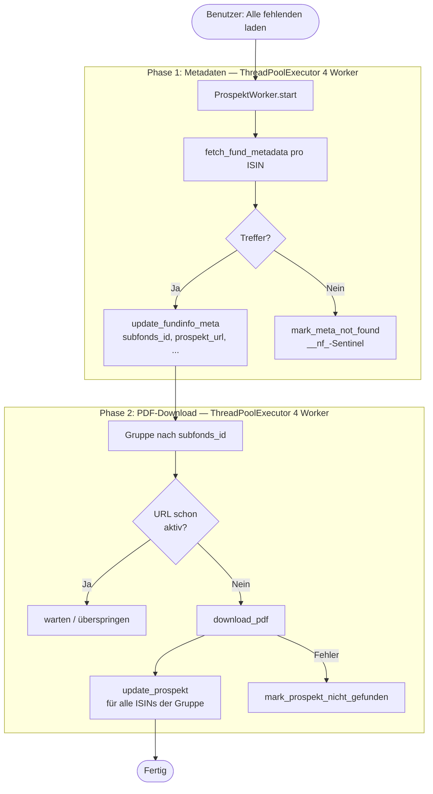
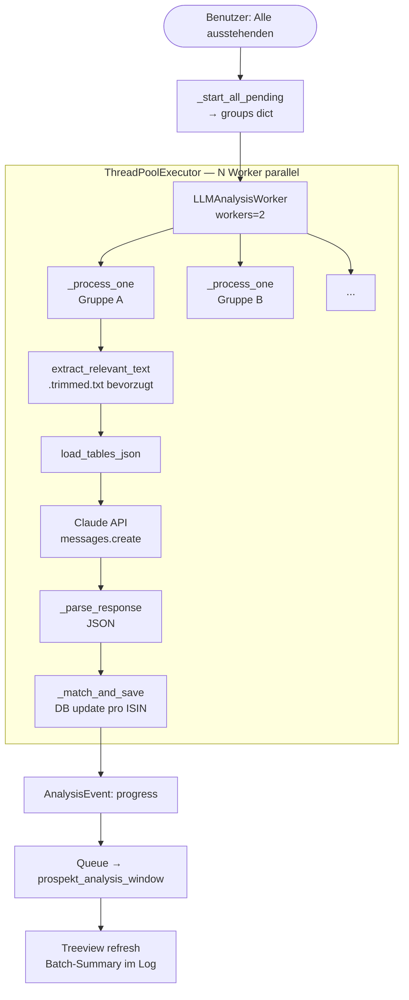

# FundsprospectPilot – Detaillierte Software-Architektur

## 1. Überblick

FundsprospectPilot ist eine Python/Tkinter-Desktopapplikation zur automatisierten Klassifizierung
von Fondsprospekten (institutionell vs. Retail) mittels der Anthropic Claude API. Kernaufgabe:
Für eine Liste von ISINs werden Verkaufsprospekte heruntergeladen, per LLM analysiert und die
Segmentierung (retail / institutional / qualified / mixed / unklar) in einer SQLite-Datenbank
gespeichert.

**Technologie-Stack**

| Schicht | Technologie |
|---|---|
| GUI | Python 3.11+, Tkinter + ttk (Catppuccin Mocha Dark Theme) |
| LLM | Anthropic Claude API (haiku / sonnet / opus) |
| PDF | pdfplumber, optional pytesseract (OCR) |
| Datenbank | SQLite 3 (WAL-Modus), openpyxl |
| HTTP | requests (fundinfo.com API, PDF-Downloads) |
| Parallelisierung | threading.Thread, concurrent.futures.ThreadPoolExecutor |
| Konfiguration | python-dotenv (.env-Datei) |
| PDF-Erzeugung | reportlab (Vergleichsberichte) |

---

## 2. Gesamtarchitektur

```
┌─────────────────────────────────────────────────────────────────────────┐
│  EINSTIEGSPUNKTE                                                         │
│                                                                          │
│   src/app.py           src/main.py         downloader/main.py           │
│   Tkinter-Hub          CLI-Batch           Eigenständiger Downloader     │
└──────────┬─────────────────┬──────────────────────┬──────────────────────┘
           │                 │                      │
           ▼                 ▼                      ▼
┌──────────────────────────────────────────────────────────────────────────┐
│  KERN-DIENSTE                                                            │
│                                                                          │
│  fundinfo_client.py   pdf_analyzer.py    claude_classifier.py           │
│  results_store.py     typologie_store.py excel_handler.py               │
│  web_search.py        utils.py                                          │
└──────────────────────────────┬───────────────────────────────────────────┘
                               │
               ┌───────────────┼────────────────┐
               ▼               ▼                ▼
      ┌──────────────┐ ┌──────────────┐ ┌──────────────┐
      │  Anthropic   │ │ fundinfo.com │ │  SQLite DB   │
      │  Claude API  │ │  JSON API    │ │  results.db  │
      └──────────────┘ └──────────────┘ └──────────────┘
```

---

## 3. Verzeichnisstruktur

```
FundsprospectPilot/
│
├── src/                                   Hauptanwendung
│   │
│   ├── app.py                             Hub-Fenster, Sidebar-Navigation, Dashboard
│   ├── main.py                            CLI-Batch-Verarbeitung (Excel → PDF → LLM → Excel)
│   │
│   ├── ── KERN-DIENSTE ──────────────────────────────────────────────────
│   ├── results_store.py                   SQLite-Datenbankschicht (fund_results)
│   ├── typologie_store.py                 Kanonische Werte (Fondstyp/Anlegertyp/Kundentyp)
│   ├── fundinfo_client.py                 fundinfo.com API-Client + PDF-Download
│   ├── pdf_analyzer.py                    PDF-Textextraktion, Tabellenextraktion
│   ├── claude_classifier.py               Claude-API-Klassifizierung (Einzel-PDF)
│   ├── excel_handler.py                   Excel-Import/Export (openpyxl)
│   ├── web_search.py                      DuckDuckGo-Fallback bei niedriger Konfidenz
│   ├── utils.py                           Logging, Dateinamen, Hilfsfunktionen
│   ├── analysis_workflow.py               Fortschrittsvisualisierung (Einzelanalyse)
│   │
│   ├── ── WORKER-THREADS ────────────────────────────────────────────────
│   ├── prospekt_worker.py                 2-Phasen Download-Worker (Thread)
│   ├── llm_analysis_worker.py             LLM-Klassifizierungs-Worker (ThreadPoolExecutor)
│   │
│   └── ── GUI-FENSTER (Toplevel) ────────────────────────────────────────
│       ├── results_window.py              Ergebnistabelle (sortierbar, filterbar)
│       ├── download_window.py             Prospekt-Downloader UI
│       ├── prospekt_analysis_window.py    LLM-Analyse-Orchestrator
│       ├── data_management_window.py      ISIN-Import / Excel-Export
│       ├── pdf_trim_window.py             LLM-basierte PDF-Kürzung + Tabellenextraktion
│       ├── comparison_window.py           Factsheet-Vergleichsanalyse (2 ISINs)
│       ├── admin_panel.py                 Einstellungen (API-Key, Modelle, Pfade)
│       ├── typologie_window.py            Taxonomie-Editor (Fondstyp/Anlegertyp/Kundentyp)
│       └── data_management_window.py      ISIN-Import, DB-Statistiken
│
├── downloader/                            Eigenständiges Downloader-Tool
│   ├── main.py
│   └── src/
│       ├── fundinfo_client.py             (ältere Version)
│       ├── prospekt_worker.py             (ältere Version)
│       ├── results_store_ext.py           DB-Adapter mit konfigurierbarem Pfad
│       ├── download_window.py
│       └── utils.py
│
├── data/
│   ├── input/                             Eingabe-Excel (ISINs)
│   ├── output/
│   │   ├── results.db                     SQLite-Datenbank
│   │   └── errors.log                     Anwendungslog
│   ├── prospekte/                         Heruntergeladene PDFs + .trimmed.txt + .tables.json
│   ├── comparisons/                       Factsheets + generierte Vergleichsberichte
│   └── samples/                           Test-PDFs
│
├── ARCHITECTURE.md                        Diese Datei
├── requirements.txt
└── .env                                   API-Keys, Pfade (nicht in git)
```

---

## 4. Datenbank-Schema (`data/output/results.db`)

SQLite-Datei, WAL-Modus (`PRAGMA journal_mode=WAL`, `PRAGMA synchronous=NORMAL`, `timeout=30`).

### Tabelle `fund_results` (Primärschlüssel: `isin`)

```
IDENTIFIKATION
  isin                TEXT  PRIMARY KEY   — ISIN (z.B. CH0012345678)
  fund_id             TEXT               — fundinfo-interne Fonds-ID
  fondsname           TEXT               — Vollständiger Fondsname (aus Import)
  subfonds_id         TEXT               — fundinfo-Subfonds-ID (Gruppierschlüssel)
  subfonds_name       TEXT               — Subfonds-Bezeichnung (z.B. "Swiss Equity")
  umbrella_id         TEXT               — Umbrella-Fonds-ID
  anteilsklasse       TEXT               — Klassen-Bezeichnung (z.B. "I", "A", "R")
  ausschuettungsart   TEXT               — "ausschüttend" | "thesaurierend"
  fondswaehrung       TEXT               — ISO-Währungscode (CHF, EUR, USD, ...)

ANALYSE-ERGEBNISSE
  segmentierung       TEXT               — Primäre Segmentierung (retail|institutional|unklar)
  fondstyp            TEXT               — ETF | UCITS | AIF | Anlagestiftung | ...
  anlegertyp          TEXT               — Professionelle Anleger | Privat | ...
  kundentyp           TEXT               — Pensionskassen | HNWI | Privatanleger | ...
  konfidenz           TEXT               — hoch | mittel | niedrig
  begruendung         TEXT               — Begründungstext (klassische Analyse)
  pruef_segmentierung TEXT               — Vorgabe aus Morningstar (Import-Vergleichswert)

LLM-ANALYSE (prospekt_analysis_window → llm_analysis_worker)
  llm_segmentierung             TEXT     — retail|institutional|qualified|mixed|unklar
  llm_segmentierung_begruendung TEXT     — LLM-Begründung (max. 400 Zeichen)
  fondstyp_roh                  TEXT     — Originaltext aus Prospekt ("S.14: ETF...")
  anlegertyp_roh                TEXT     — Originaltext aus Prospekt mit Seitenangabe
  kundentyp_roh                 TEXT     — Originaltext aus Prospekt mit Seitenangabe
  mindestanlage                 TEXT     — Mindestzeichnung (z.B. "500'000 CHF")
  mindestanlage_roh             TEXT     — Originaltext aus Prospekt mit Seitenangabe

FUNDINFO-API-METADATEN
  fundinfo_ter                  TEXT     — TER aus fundinfo-API
  fundinfo_investor_type        TEXT     — Anlegertyp laut fundinfo
  ongoing_charges_datum         TEXT     — Datum der laufenden Kosten
  qualif_anleger_ch             TEXT     — Qualifizierter Anleger CH (ja/nein)
  institutional_ch              TEXT     — Institutionell CH (ja/nein)

DOKUMENTE
  prospekt_pfad             TEXT         — Lokaler Dateipfad des PDFs
  prospekt_url              TEXT         — Download-URL (fundinfo.com)
  prospekt_nicht_gefunden   TEXT         — Zeitstempel wenn Prospekt nicht auffindbar
  pdf_datei                 TEXT         — Dateiname (Legacy)

TRACKING & ZEITSTEMPEL
  quelle            TEXT               — Analysequelle (claude_classifier, llm_worker)
  modell            TEXT               — Eingesetztes Claude-Modell
  analysiert_am     TEXT               — Letztes Analysedatum (YYYY-MM-DD HH:MM)
  erstellt_am       TEXT               — Erstelldatum in DB
  ueberschrieben_am TEXT               — Datum der letzten Überschreibung
  ter               TEXT               — TER (Legacy)
```

**Sentinels:**
- `subfonds_id = '__nf_<isin>'` → Phase 1 hat keinen fundinfo-Treffer gefunden
- `prospekt_nicht_gefunden != ''` → Prospekt-URL existiert nicht / Download gescheitert

### Tabelle `typologie` (Primärschlüssel: `id`)

```
id        INTEGER PRIMARY KEY
feld      TEXT    — "fondstyp" | "anlegertyp" | "kundentyp"
wert      TEXT    — Kanonischer Wert (z.B. "Pensionskassen")
segment   TEXT    — retail | institutional
synonyme  TEXT    — Komma-getrennte Alternativbegriffe für LLM-Mapping
sortierung INTEGER — Anzeigereihenfolge
```

---

## 5. Kern-Module im Detail

### 5.1 `results_store.py` — Datenbankschicht

Einzige Schicht die direkt auf SQLite zugreift. Jede Funktion öffnet eine eigene Connection
(thread-sicher durch WAL-Modus).

```
Wichtige Funktionen:
  init_db()                 Schema erstellen + neue Spalten auto-migrieren
  upsert_result()           INSERT/UPDATE klassisches Analyseergebnis
  update_fundinfo_meta()    Speichert API-Metadaten (nur leere Felder überschreiben)
  update_prospekt()         Speichert PDF-Pfad + URL
  update_llm_analysis()     Speichert LLM-Ergebnisse (überschreibt immer)
  get_all_results()         Alle Einträge, nach analysiert_am DESC sortiert
  get_stats()               retail/institutional/unklar/total Zählungen
                            → CASE WHEN llm_segmentierung != '' THEN llm_segmentierung
                                   ELSE segmentierung END
  get_no_metadata_results() ISINs ohne prospekt_url (Metadaten nicht gefunden)
  get_prospekt_queue()      ISINs ohne lokales PDF (Download ausstehend)
  get_analysis_queue()      ISINs mit PDF aber ohne llm_segmentierung
  get_subfonds_groups()     Gruppierung nach subfonds_id
  import_base_set()         Bulk-Import ohne Überschreibung existierender ISINs
  mark_meta_not_found()     Setzt __nf_-Sentinel in subfonds_id
  mark_prospekt_nicht_gefunden()  Setzt Zeitstempel in prospekt_nicht_gefunden
  delete_result()           Löscht ISIN-Eintrag
```

### 5.2 `fundinfo_client.py` — API-Client

```
Endpunkt:
  GET https://www.fundinfo.com/en/{profile}/LandingPage/Data
  ?skip=0&query={ISIN}&orderdirection=desc

Profile-Fallback-Reihenfolge:
  CH-prof → CH-pub → DE-prof → LU-prof → AT-prof

Sprach-Präferenz (für Prospekt-URL):
  DE → EN → FR → IT → ES

Wichtige Funktionen:
  fetch_fund_metadata(isin)       Gibt subfonds_id, subfonds_name, umbrella_id,
                                  anteilsklasse, ausschuettungsart, fondswaehrung,
                                  fundinfo_ter, prospekt_url, ... zurück
  download_pdf(url, path)         HTTP GET mit Retry (max. 3 Versuche),
                                  PDF-Magic-Bytes-Validierung (%PDF),
                                  Grössenprüfung (max. 50 MB)
  fetch_comparison_docs(isin)     Factsheet + Jahres-/Halbjahresbericht
```

### 5.3 `pdf_analyzer.py` — PDF-Verarbeitung

```
extract_relevant_text(pdf_path)
  ├── Prüft ob <pdf_path>.trimmed.txt existiert → lädt diesen (bevorzugt, weniger Tokens)
  └── Sonst: extract_relevant_sections(extract_text_from_pdf(pdf_path))
             → Keyword-Filter (Investor, Mindestzeichnung, MiFID, UCITS, ...)

extract_text_from_pdf(pdf_path)
  ├── pdfplumber: Seite für Seite
  └── Fallback: OCR via pytesseract + pdf2image (wenn pdfplumber leer)

extract_tables_from_pdf(pdf_path) → list[{"page", "headers", "rows"}]
  └── Filtert nach Relevanz-Keywords: ISIN, WKN, Mindest*, Anteilsklasse, ...

save_tables_json(pdf_path, tables)  → <pdf_path>.tables.json
load_tables_json(pdf_path)          → list[dict] | []
```

### 5.4 `claude_classifier.py` — LLM-Klassifizierung (Einzel-PDF)

Wird vom CLI-Modus (`main.py`) und in der Einzelanalyse verwendet — nicht vom
`LLMAnalysisWorker` (der hat einen eigenen Prompt).

```
classify_prospectus(text, isin, fondsname, web_context=None)
  System-Prompt:
    "Klassifiziere als JSON: segmentierung, fondstyp, anlegertyp,
     kundentyp, begruendung, konfidenz"
  Prompt-Caching: cache_control: ephemeral auf System-Prompt
  Modell: DEFAULT_BATCH_MODEL = claude-haiku-4-5-20251001
           DEFAULT_SINGLE_MODEL = claude-sonnet-4-6
  Max-Tokens: 512
  Output-Normalisierung:
    segmentierung: retail | institutional | unklar
    konfidenz:     hoch | mittel | niedrig
```

### 5.5 `utils.py` — Hilfsfunktionen

```
setup_logging()           Dual-Log: Konsole + data/output/errors.log (UTF-8)
get_next_pdf_number()     Nächste freie 5-stellige Nummer in data/prospekte/
build_pdf_filename()      "<nr>_<sanitized_name>_XX.pdf"
extract_relevant_sections(text)
                          Keyword-Filterung: behält Absätze mit
                          investor|anleger|mindest|minimum|ucits|aif|
                          mifid|vertrieb|zielmarkt|profil|klasse
validate_api_key(key)     Test-Call an Claude (1 Token), gibt bool zurück
```

---

## 6. GUI-Fenster im Detail

### 6.1 `app.py` — Hub-Fenster

```
Grösse: 960×660 (min 800×580)
Layout: Sidebar (145px) + Content-Bereich

Sidebar-Navigation:
  📊 Ergebnisse    → results_window.ResultsWindow
  🗃  Daten         → data_management_window.DataManagementWindow
  📄 Prospekte     → download_window.DownloadWindow
  🔬 Analyse       → prospekt_analysis_window.ProspektAnalysisWindow
  ✂  PDF-Kürzer    → pdf_trim_window.PdfTrimWindow
  ⚖  Vergleich     → comparison_window.ComparisonWindow
  ⚙  Admin         → admin_panel.AdminPanel

Dashboard (5 Statistik-Karten, Refresh alle 5s):
  ISINs gesamt | Analysiert | Retail | Institutional | Unklar
  Quelle: results_store.get_stats()
  → CASE WHEN llm_segmentierung != '' THEN llm_segmentierung ELSE segmentierung END

Aktivitäts-Log:
  ScrolledText mit farbkodierten Tags:
    ok     → ACCENT_GREEN    (✅ Meldungen)
    error  → ACCENT_RED      (❌ Meldungen)
    warn   → ACCENT_YELLOW   (⤵ ✂ Meldungen)
    info   → ACCENT_BLUE
    rule   → ACCENT_LAVENDER (📐 Regelextraktor)
    llm    → #cba6f7         (🤖 LLM-Meldungen)
    detail → #6c7086         (eingerückte Details)

Event-Queue (_progress_queue):
  Polling alle 200ms via self.after()
  Empfängt ProspektEvent / AnalysisEvent von Worker-Threads
  Typen: log | progress | error | done
```

### 6.2 `results_window.py` — Ergebnistabelle

```
Grösse: 1100×600 (min 800×400)
Treeview: 25 Spalten, scrollbar horizontal+vertikal
Selectmode: browse (Einzel-Auswahl)

Toolbar-Buttons:
  Aktualisieren           → refresh() → results_store.get_all_results()
  Excel exportieren       → _export_excel() (alle sichtbaren Zeilen, openpyxl)
  Ohne Metadaten export.  → _export_no_metadata()
                            → results_store.get_no_metadata_results()
                            → Speicherdialog: .xlsx oder .csv (UTF-8 mit BOM)
                            Exportierte Spalten: ISIN, Fondsname, Subfonds,
                            Anteilsklasse, Ausschüttung, Währung,
                            Importiert am, Prospekt-Suche (Datum)

Suchleiste:
  Live-Filter auf: isin, fondsname, fondstyp, segmentierung

Sortierung:
  Klick auf Spalten-Header → _sort_by(col_key)
  Toggle aufsteigend/absteigend, Pfeil im Header

Farb-Tags:
  retail        → fg #a6e3a1 bg #1e2e1e (grün)
  institutional → fg #89b4fa bg #1e2030 (blau)
  unklar        → fg #f9e2af bg #2e2a1e (gelb)

Doppelklick → _show_detail(row):
  Öffnet Detail-Toplevel mit:
    win.transient(self) + win.grab_set()  → nur ein Detailfenster gleichzeitig
  Gruppen: Identifikation | Analyse | Begründung |
           Fundinfo API | Prospekt | Rohdaten LLM
  Lange Texte: tk.Text (Mehrzeilen), kurze: tk.Label
  Schliessen-Button unten

Aktionsleiste:
  Ausgewählten Eintrag löschen → results_store.delete_result(isin) + refresh()
```

### 6.3 `download_window.py` — Prospekt-Downloader

```
Toolbar:
  Alle fehlenden laden    → ProspektWorker (gesamte Queue)
  Ausgewählte laden       → ProspektWorker (nur markierte ISINs)
  Stopp                   → worker.stop()
  Ausstehende überspringen Checkbox (prospekt_nicht_gefunden)

Tabelle (Treeview):
  ISIN | Unterfonds | Anteilsklasse | Prospekt-Datei | Prospekt-URL | Nicht gef.
  Farben: grün=vorhanden, gelb=in Queue, rot=nicht gefunden, muted=offen

Fortschrittsbalken + Log
```

### 6.4 `prospekt_analysis_window.py` — LLM-Analyse

```
Grösse: 960×700 (min 780×520)

Toolbar:
  Modell-Dropdown (sonnet / opus / haiku)
  Worker-Spinbox 1–4  → wird an LLMAnalysisWorker.workers übergeben
  📋 Werte → typologie_window.TypologieWindow
  ✏  Prompt → Prompt-Editor (Toplevel, grab_set)
  ⏹  Stopp  → worker.stop()

Kontroll-Zeile:
  ▶ Alle ausstehenden    → _start_all_pending()
  ▶ Ausgewählte starten  → _start_selected()
  ↺ Refresh
  □ nur ausstehende Checkbox
  Zusammenfassung: "Gesamt: N | ✓ N | ⏳ N | — N (kein PDF)"

Treeview der Subfonds-Gruppen:
  Spalten: Subfonds/Name | Umbrella | ISINs | Offen | Status | Letzte Analyse
  Selectmode: extended (Multi-Auswahl via Ctrl/Shift)
  Tags/Farben:
    pending → ACCENT_YELLOW bg #272917 (ausstehend)
    partial → ACCENT_BLUE   bg #18192c (teilweise)
    done    → ACCENT_GREEN  bg #172317 (fertig)
    no_pdf  → FG_MUTED      bg BG_PANEL (kein PDF)
  Doppelklick → Einzel-Gruppe starten
  Sortierung durch Header-Klick

Fortschrittsbalken + kompakter Log (7 Zeilen)

Batch-Abschluss-Summary:
  Log: "────────────────────────────────────────────────────────────"
       "✅  Fertig — Analysiert: N | Fehler: N | Übersprungen: N"
       [Liste fehlgeschlagener Gruppen falls vorhanden]
  Popup: showwarning() mit Fehlerliste (max. 20 Einträge) wenn failed > 0
```

### 6.5 `pdf_trim_window.py` — PDF-Kürzung

```
Listet alle PDFs aus data/prospekte/
Zwei Operationen pro PDF:
  1. Tabellen extrahieren → pdf_analyzer.extract_tables_from_pdf()
                          → speichert <name>.tables.json
  2. LLM-Trim           → Claude kürzt PDF auf relevante Abschnitte
                          → speichert <name>.trimmed.txt

Prompt-Anweisung an LLM:
  Behalten: Anteilsklassen-Tabellen, ISIN-Listen, Anleger-Einschränkungen,
            Vertriebsbeschränkungen, regulatorische Klassifizierungen,
            Mindestzeichnungsbeträge, KAG/FIDLEG/MiFID-Verweise
  Entfernen: Risiko-Beschreibungen, Performance-Daten, Verwaltungsdetails,
             Steuerhinweise, allgemeine Marktbeschreibungen

.trimmed.txt wird von extract_relevant_text() automatisch bevorzugt.
```

### 6.6 `comparison_window.py` — Fonds-Vergleich

```
Workflow:
  1. Zwei ISINs aus DB auswählen
  2. Vergleichs-Dokumente laden (Factsheets, Jahres-/Halbjahresbericht)
     via fundinfo_client.fetch_comparison_docs()
  3. Text extrahieren, an Claude senden
  4. JSON-Ausgabe parsen:
     besser_performer | performance_1y/3y/5y | sharpe_ratio
     ter_vergleich | top_holdings_diff | managementstil
  5. PDF-Bericht generieren (reportlab)
     → data/comparisons/<timestamp>_vergleich.pdf

Fehlerbehandlung: AuthenticationError | RateLimitError |
                  BadRequestError | APIStatusError → Log + Popup
stop_reason == "max_tokens" → Warning im Log
```

### 6.7 `admin_panel.py` — Einstellungen

```
Felder:
  ANTHROPIC_API_KEY   (maskiert, Validierungs-Button → utils.validate_api_key())
  EXCEL_PATH          (Dateibrowser)
  PDF_FOLDER          (Ordnerbrowser)
  BATCH_SIZE          (Spinbox 1–1000)
  CLAUDE_BATCH_MODEL  (Dropdown)
  CLAUDE_SINGLE_MODEL (Dropdown)

Speichern → dotenv.set_key() schreibt in .env-Datei
```

### 6.8 `data_management_window.py` — Daten-Import/Export

```
Tab 1 — ISIN-Import:
  Excel laden → Spalten: ISIN, GroupInvestment, Morningstar_Segmentierung
  results_store.import_base_set() → INSERT ohne Überschreibung existierender ISINs
  Zusammenfassung: (n_imported, n_skipped)

Tab 2 — Ergebnisse:
  DB-Statistiken + Export-Button → results_store.export_to_excel()
```

### 6.9 `typologie_window.py` — Taxonomie-Editor

```
3 Tabs: Fondstyp | Anlegertyp | Kundentyp
Pro Tab: Treeview mit Wert, Segment, Synonyme
Aktionen: Hinzufügen | Bearbeiten | Löschen
Änderungen sofort wirksam in DB → nächster LLM-Lauf nutzt neue Werte
```

---

## 7. Worker-Threads

### 7.1 `prospekt_worker.py` — 2-Phasen-Download

```
ProspektWorker(threading.Thread):

Phase 1 — Metadaten parallel laden (ThreadPoolExecutor, 4 Worker):
  Pro ISIN ohne subfonds_id:
    fundinfo_client.fetch_fund_metadata(isin)
    results_store.update_fundinfo_meta(isin, subfonds_id, prospekt_url, ...)
    Fehler: results_store.mark_meta_not_found(isin)
  Rate-Limiting: 1.0s zwischen API-Calls (self._meta_delay)

Phase 2 — Gruppierter PDF-Download (ThreadPoolExecutor, 4 Worker):
  ISINs nach subfonds_id gruppieren
  Pro Gruppe (1 PDF für alle ISINs der Gruppe):
    URL-Duplikats-Check via _url_lock + _active_urls (verhindert Doppel-Download)
    fundinfo_client.download_pdf(url, path)
    results_store.update_prospekt(isin, pfad, url) — für alle ISINs der Gruppe
    Fehler: results_store.mark_prospekt_nicht_gefunden(isin)

Thread-Sicherheit:
  self._lock        → schützt _done/_failed/_skipped Zähler
  self._url_lock    → schützt _active_urls Set
  SQLite WAL-Modus  → ermöglicht parallele Schreibzugriffe

Events (ProspektEvent → queue.Queue):
  type: log | progress | error | done
  Felder: isin, message, phase, total, done, skipped, failed
```

### 7.2 `llm_analysis_worker.py` — Parallele LLM-Analyse

```
LLMAnalysisWorker(threading.Thread):

Konstruktor-Parameter:
  groups: dict[group_key → list[row]]
  prompt_template: str    (mit {isin_list} Platzhalter)
  model: str
  api_key: str
  event_queue: queue.Queue
  workers: int = 2        (1–4, konfigurierbar via Spinbox im Fenster)

run():
  ThreadPoolExecutor(max_workers=self._workers)
  Pro Gruppe → _process_one(group_key, group_rows, total) in Worker-Thread

_process_one(group_key, group_rows, total):
  1. Stop-Flag prüfen (bei Abbruch sofort return)
  2. PDF-Pfad ermitteln (erste vorhandene prospekt_pfad der Gruppe)
  3. pdf_analyzer.extract_relevant_text(pdf_path)
     → bevorzugt .trimmed.txt, sonst Keyword-Filterung
  4. pdf_analyzer.load_tables_json(pdf_path)
     → _format_tables_for_prompt(tables) voranstellen
  5. _call_llm(pdf_text, group_rows):
     prompt = template.replace("{isin_list}", _build_isin_list(group_rows))
     client.messages.create(model, max_tokens=2048, system+user mit Prompt-Caching)
     Fehlerbehandlung:
       AuthenticationError → RuntimeError (API-Key ungültig)
       RateLimitError      → RuntimeError (Rate Limit)
       BadRequestError     → RuntimeError (Kontext zu lang)
       APIStatusError      → RuntimeError (HTTP-Fehler)
     stop_reason == "max_tokens" → logger.warning (JSON möglicherweise unvollständig)
  6. _parse_response(raw): JSON extrahieren (```json ... ``` oder roher Block)
  7. _match_and_save(parsed, group_rows, model):
     Matching: by_isin (ISIN direkt) → by_name (anteilsklasse_name) → fallback erster Eintrag
     _normalize_seg(raw): retail/privat→retail, institutional/institutionell→institutional, ...
     results_store.update_llm_analysis(isin, fondstyp, anlegertyp, kundentyp,
       llm_segmentierung, llm_segmentierung_begruendung, *_roh, mindestanlage, modell)

Thread-Sicherheit:
  self._lock → schützt _done/_failed/_skipped
  Anthropic-Client: pro _call_llm() neue Instanz (thread-sicher)
  SQLite WAL-Modus: parallele Schreibzugriffe ohne Konflikte

Stop-Mechanismus:
  worker.stop() → self._stop_flag = True
  Laufende Tasks beenden sich natürlich
  Wartende Tasks: future.cancel() + sofortiger return bei stop_flag-Prüfung

Events (AnalysisEvent → queue.Queue):
  type: log | progress | error | done
  Felder: isin, message, total, done, failed, skipped
```

**LLM-Prompt-Struktur (Analyse-Fenster):**

```
System-Prompt:
  Experten-Kontext (Schweizer KAG/CISA, UCITS, AIFMD, MiFID II)
  Erlaubte Werte: {fondstyp_liste} {anlegertyp_liste} {kundentyp_liste}
    → aus typologie_store.get_wert_liste()
  Aufgabe 1: Fondseigenschaften (Fondstyp, Anlegertyp, Kundentyp + Roh-Werte)
  Aufgabe 2: Segmentierung pro Anteilsklasse
    → retail|institutional|qualified|mixed|unklar
    → Mindestanlage + Roh-Wert
  Bekannte ISINs: {isin_list}

Prompt-Caching:
  System-Prompt: cache_control = ephemeral
  User-Message (PDF-Text, max. 80.000 Zeichen): cache_control = ephemeral

Ausgabe (JSON):
  {
    "fondstyp": "...", "fondstyp_roh": "S.14: ...",
    "anlegertyp": "...", "anlegertyp_roh": "S.xx: ...",
    "kundentyp": "...", "kundentyp_roh": "S.xx: ...",
    "anteilsklassen": [
      {
        "isin": "...", "anteilsklasse_name": "...",
        "segmentierung": "retail|institutional|qualified|mixed|unklar",
        "begruendung": "max. 200 Zeichen",
        "mindestanlage": "500'000 CHF",
        "mindestanlage_roh": "S.xx: ..."
      }
    ]
  }
```

---

## 8. Datenflüsse

### 8.1 Prospekt-Download (2-Phasen)



### 8.2 LLM-Analyse (parallel)



### 8.3 Ergebnis-Anzeige-Pipeline

```
results_store.get_all_results()
  └── results_window._fill_tree()
       ├── Tag nach segmentierung (retail/institutional/unklar)
       ├── Sortierung nach gewählter Spalte
       └── Filter nach Suchbegriff

Doppelklick → _show_detail()
  └── Toplevel (transient + grab_set)
       ├── Identifikation: isin, fondsname, subfonds_name, anteilsklasse, ...
       ├── Analyse: segmentierung, fondstyp, anlegertyp, kundentyp, konfidenz
       ├── Begründung: llm_segmentierung_begruendung
       ├── Fundinfo API: fundinfo_ter, fundinfo_investor_type, ...
       ├── Prospekt: prospekt_url, prospekt_pfad
       └── Rohdaten LLM: llm_segmentierung, fondstyp_roh, anlegertyp_roh, kundentyp_roh
```

---

## 9. Thread-Kommunikation

```
  Hauptthread (Tkinter-Event-Loop)          Worker-Threads
  ─────────────────────────────────         ─────────────────────────────
  app.py / *_window.py                      ProspektWorker / LLMAnalysisWorker
  │                                         │
  │   queue.Queue (thread-sicher)           │
  │◄────────────────────────────────────────│ worker._emit(AnalysisEvent)
  │                                         │   oder
  │  self.after(200, _poll_queue)           │ worker._queue.put(ProspektEvent)
  │  └─ non-blocking get_nowait()           │
  │                                         │
  └─► GUI aktualisieren:                    └─► Läuft im Daemon-Thread
      Progressbar                               (endet mit Hauptprozess)
      Log-Einträge (farbkodiert)
      Status-Variable
      Dashboard-Refresh
      Treeview-Update
```

**Wichtig:** Tkinter ist **nicht thread-sicher**. Kein Worker-Thread darf direkt GUI-Elemente
manipulieren. Alle GUI-Updates laufen über die Event-Queue im Hauptthread.

---

## 10. Externe Integrationen

### Anthropic Claude API

```
Endpunkt: https://api.anthropic.com/v1/messages
SDK:       anthropic (Python)

Verwendete Modelle:
  claude-haiku-4-5-20251001  — Batch-Klassifizierung (schnell, günstig)
  claude-sonnet-4-6          — LLM-Analyse, Vergleich (Standard)
  claude-opus-4-7            — Komplexe Fälle (manuell wählbar)

Prompt-Caching (Kostensenkung):
  cache_control: {"type": "ephemeral"} auf System-Prompt + erstem User-Block
  → gleichartige Batch-Calls teilen den gecachten Kontext

Fehlerbehandlung (alle LLM-Call-Sites):
  AuthenticationError → Abbruch + Fehlermeldung (API-Key ungültig)
  RateLimitError      → Abbruch + Fehlermeldung (Limit erreicht)
  BadRequestError     → Abbruch + Fehlermeldung (Input zu lang)
  APIStatusError      → Abbruch + HTTP-Statuscode in Meldung
  stop_reason == "max_tokens" → Warning (JSON möglicherweise abgeschnitten)
```

### fundinfo.com API

```
Basis-URL: https://www.fundinfo.com
Endpunkt:  /en/{profile}/LandingPage/Data
           ?skip=0&query={ISIN}&orderdirection=desc
Format:    JSON

Rückgabe pro ISIN:
  subfonds_id, subfonds_name, umbrella_id
  anteilsklasse, ausschuettungsart, fondswaehrung
  fundinfo_ter, fundinfo_investor_type
  ongoing_charges_datum
  qualif_anleger_ch, institutional_ch
  prospekt_url (Link auf PDF-Dokument)

Rate-Limiting:
  Phase 1: 1.0s Pause zwischen API-Calls (meta_delay)
  Phase 2: kein expliziter Delay (natürliche Download-Latenz)

Session-Header: Browser-User-Agent (verhindert Blockierung)
```

---

## 11. Taxonomie-System

```
Kanonische Werte in DB-Tabelle `typologie`:

Fondstyp (Beispiele):
  ETF | Anlagestiftung | Publikumsfonds | Institutioneller Fonds | UCITS | AIF | ...

Anlegertyp:
  Professionelle Anleger | Privat | Qualifizierte Anleger

Kundentyp (18+ Einträge):
  Institutionell: Pensionskassen, Versicherungen, Stiftungen, Anlagestiftungen,
                  Banken, Family Offices, Staatsfonds, HNWI, UHNWI
  Retail:         Privatanleger, Wohlhabende Privatkunden, Kleinanleger

Synonyme-Mapping (für LLM-Output-Normalisierung):
  "Qualified Investor" → Qualifizierte Anleger
  "semiprofessionell"  → Professionelle Anleger
  usw.

Verwendung:
  _build_prompt_with_taxonomy() (prospekt_analysis_window.py)
    → ersetzt {fondstyp_liste}, {anlegertyp_liste}, {kundentyp_liste}
    → LLM wird auf kanonische Werte eingeschränkt
```

---

## 12. Konfiguration (`.env`)

| Variable | Standard | Beschreibung |
|---|---|---|
| `ANTHROPIC_API_KEY` | — | **Pflichtfeld** — von console.anthropic.com |
| `EXCEL_PATH` | `data/input/fonds_universe.xlsx` | Eingabe-Excel mit ISINs |
| `PDF_FOLDER` | `data/prospectus` | PDF-Ausgabeordner (Legacy) |
| `BATCH_SIZE` | `200` | ISINs pro CLI-Batch-Lauf |
| `CLAUDE_BATCH_MODEL` | `claude-haiku-4-5-20251001` | Modell für Batch-Klassifizierung |
| `CLAUDE_SINGLE_MODEL` | `claude-sonnet-4-6` | Modell für Einzelanalyse |

---

## 13. Wichtige Design-Entscheidungen

| Entscheidung | Begründung |
|---|---|
| SQLite statt PostgreSQL | Keine Server-Infrastruktur, single-user, embeddable |
| WAL-Modus + timeout=30 | Parallele Writer-Threads ohne Sperrkonflikte |
| Queue statt Callbacks | Tkinter nicht thread-sicher — Entkopplung zwingend |
| Subfonds-Gruppierung | 1 PDF pro Subfonds deckt alle Anteilsklassen ab — spart API-Calls |
| .trimmed.txt Dateien | Reduziert Input-Tokens 5–10× → niedrigere Kosten, schnellere Analyse |
| .tables.json Dateien | Strukturierte Tabellen vorangestellt → bessere ISIN-Erkennung durch LLM |
| Prompt-Caching | Gleicher System-Prompt über Batch → Cache-Hit senkt Kosten ~90% |
| Parallelisierung 2 Worker | Halbiert Laufzeit; bleibt sicher unter typischen Rate-Limits |
| grab_set auf Detail-Fenster | Verhindert versehentliches Öffnen mehrerer Detailansichten |
